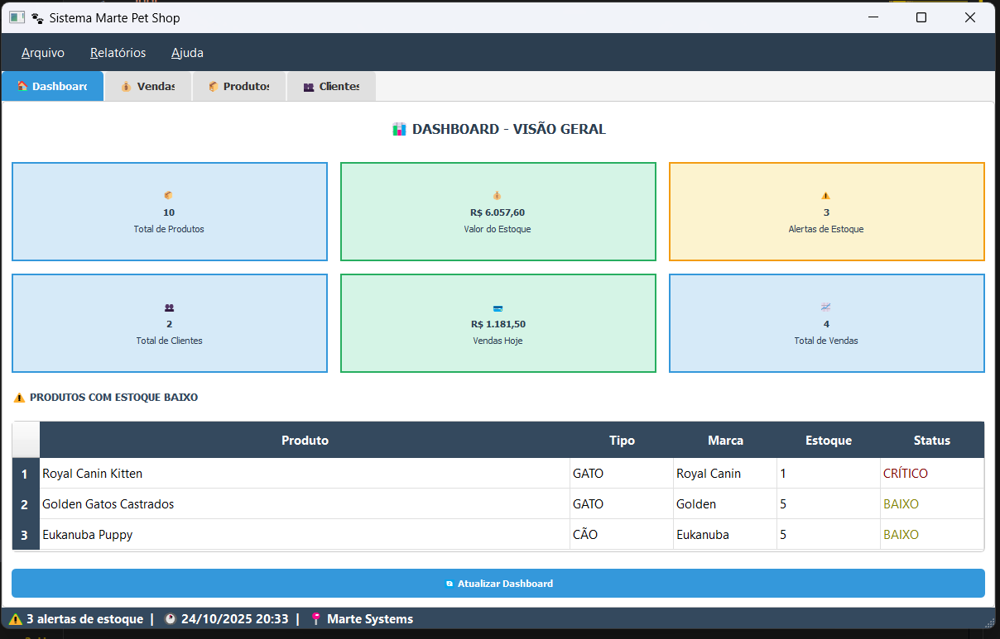

# 🐾 Sistema Marte Pet Shop

Sistema completo de gerenciamento para Pet Shops com interface gráfica moderna, desenvolvido em Python com PyQt5.


## 📸 Screenshots


*Dashboard com visão geral do sistema*

## 🌟 Funcionalidades

### ✅ Módulo de Produtos
- Cadastro completo de rações e produtos
- Controle de estoque com alertas automáticos
- Entrada e saída de mercadorias
- Preço de custo e venda
- Cálculo automático de margem de lucro
- Filtros por tipo de animal (cão/gato)

### ✅ Módulo de Vendas (PDV)
- Ponto de Venda completo e intuitivo
- Carrinho de compras
- Múltiplas formas de pagamento
- Sistema de descontos
- Baixa automática de estoque
- Histórico de vendas

### ✅ Módulo de Clientes
- Cadastro completo de clientes
- Validação de CPF e telefone
- Histórico de compras
- Busca rápida

### ✅ Dashboard Inteligente
- Visão geral em tempo real
- Estatísticas de vendas e estoque
- Alertas de produtos com estoque baixo
- Cards informativos coloridos
- Atualização automática

### ✅ Recursos Adicionais
- Sistema de backup automático
- Validações robustas de dados
- Interface responsiva e moderna
- Atalhos de teclado
- Mensagens de confirmação

## 🛠️ Tecnologias Utilizadas

- **Python 3.8+** - Linguagem principal
- **PyQt5** - Interface gráfica
- **SQLite3** - Banco de dados
- **Architecture:** MVC Pattern (Model-View-Controller)

## 📦 Instalação

### Pré-requisitos

- Python 3.8 ou superior
- pip (gerenciador de pacotes Python)

### Passo a Passo

1. **Clone o repositório**
```bash
git clone https://github.com/costaendriw/Marte_PetShop_System.git
cd Marte_PetShop_System
```

2. **Crie um ambiente virtual (recomendado)**
```bash
python -m venv venv

# Windows
venv\Scripts\activate

# Linux/Mac
source venv/bin/activate
```

3. **Instale as dependências**
```bash
pip install -r requirements.txt
```

4. **Execute o sistema**
```bash
python main.py
```

## 🚀 Uso Rápido

1. Ao iniciar, o sistema cria automaticamente:
   - Banco de dados SQLite
   - 10 produtos de exemplo
   - 1 cliente padrão
   - Pastas necessárias (backups, relatórios)

2. **Navegue pelas abas:**
   - 🏠 **Dashboard:** Visão geral
   - 💰 **Vendas:** PDV para realizar vendas
   - 📦 **Produtos:** Gerenciar produtos
   - 👥 **Clientes:** Gerenciar clientes

3. **Atalhos úteis:**
   - `Ctrl+B` - Fazer backup
   - `Ctrl+Q` - Sair do sistema
   - Duplo-clique em itens para editar

## 📁 Estrutura do Projeto
```
Marte_PetShop_System/
├── business/              # Lógica de negócio
│   ├── produto_service.py
│   ├── cliente_service.py
│   ├── venda_service.py
│   └── estoque_service.py
├── config/                # Configurações
│   └── settings.py
├── database/              # Camada de dados
│   ├── db_manager.py
│   └── models.py
├── gui/                   # Interface gráfica
│   ├── main_window.py
│   ├── styles/
│   └── widgets/
├── utils/                 # Utilitários
│   ├── validators.py
│   └── formatters.py
├── main.py               # Ponto de entrada
├── requirements.txt      # Dependências
└── README.md            # Este arquivo
```

## 🎯 Roadmap

### ✅ Versão 1.0 (Atual)
- [x] Interface gráfica completa
- [x] CRUD de produtos, clientes e vendas
- [x] Controle de estoque
- [x] Dashboard com estatísticas
- [x] Sistema de backup

### 🔄 Versão 2.0 (Próxima)
- [ ] Relatórios em PDF
- [ ] Impressão de comprovantes
- [ ] Sistema de login
- [ ] Histórico detalhado de vendas
- [ ] Busca por código de barras
- [ ] Atalhos de teclado avançados

### 🔮 Versão 3.0 (Futuro)
- [ ] Sistema multi-loja
- [ ] Aplicativo mobile
- [ ] Integração com e-commerce
- [ ] Nota Fiscal Eletrônica (NF-e)
- [ ] API REST
- [ ] Relatórios com gráficos

## 🤝 Contribuindo

Contribuições são bem-vindas! Sinta-se à vontade para:

1. Fazer um Fork do projeto
2. Criar uma branch para sua feature (`git checkout -b feature/NovaFuncionalidade`)
3. Commit suas mudanças (`git commit -m 'Adiciona nova funcionalidade'`)
4. Push para a branch (`git push origin feature/NovaFuncionalidade`)
5. Abrir um Pull Request

## 📝 Licença

Este projeto está sob a licença MIT. Veja o arquivo [LICENSE](LICENSE) para mais detalhes.

## 👤 Autor

**Endriw Costa**

- GitHub: [@costaendriw](https://github.com/costaendriw)
- LinkedIn: [Seu LinkedIn](https://linkedin.com/in/seu-perfil)

## 🙏 Agradecimentos

- Comunidade Python Brasil
- Desenvolvedores do PyQt5
- Todos que contribuíram com feedback

## 📞 Suporte

Para suporte, abra uma [issue](https://github.com/costaendriw/Marte_PetShop_System/issues) ou entre em contato.

---

⭐ Se este projeto te ajudou, considere dar uma estrela no GitHub!


